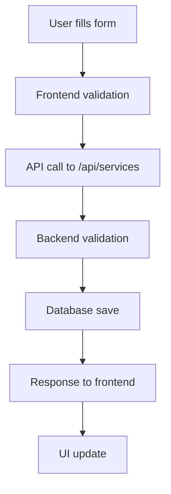
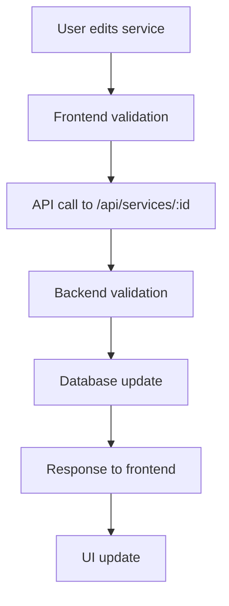

# Service Integration Guide

## Overview

This document explains the complete integration between the frontend Pricing page and backend service management system for the LikesIO Instagram growth platform.

## Architecture

### Frontend (React + TypeScript)
- **Location**: `src/pages/Pricing.tsx`
- **Service Layer**: `src/services/service-service.ts`
- **API Client**: `src/services/api-services.ts`

### Backend (Node.js + Express + MongoDB)
- **Models**: `models/Service.js`, `models/Order.js`
- **Controllers**: `controllers/services.js`
- **Routes**: `routes/services.js`
- **Supplier Integration**: `utils/supplierService.js`

## Service Types Supported

The system supports four main service types:

1. **Followers** - Instagram follower growth
2. **Likes** - Instagram post likes
3. **Views** - Instagram video views
4. **Comments** - Instagram post comments

Each service type has two quality tiers:
- **General** - Standard quality, lower cost
- **Premium** - High quality, higher cost

## Supplier Service IDs

The system uses predefined supplier service IDs for each service type and quality:

| Service Type | Quality | Supplier ID |
|--------------|---------|-------------|
| Followers | General | 2183 |
| Followers | Premium | 3305 |
| Likes | General | 1782 |
| Likes | Premium | 1761 |
| Views | General | 8577 |
| Views | Premium | 340 |
| Comments | General | 1234 |
| Comments | Premium | 5678 |

## Data Flow

### 1. Service Creation Flow



### 2. Service Update Flow



## API Endpoints

### GET /api/services
- **Purpose**: Fetch all services
- **Query Parameters**: 
  - `type`: Filter by service type
  - `quality`: Filter by quality
  - `active`: Filter by active status
  - `popular`: Filter by popular status

### POST /api/services
- **Purpose**: Create new service
- **Required Fields**:
  - `name`: Service name
  - `type`: Service type (followers, subscribers, likes, views, comments)
  - `quality`: Quality tier (general, premium)
  - `supplierServiceId`: Supplier service ID
  - `description`: Service description
  - `price`: Retail price
  - `supplierPrice`: Wholesale price
  - `minQuantity`: Minimum order quantity
  - `maxQuantity`: Maximum order quantity
  - `deliverySpeed`: Delivery time description

### PUT /api/services/:id
- **Purpose**: Update existing service
- **Restrictions**: Cannot change type, quality, or supplierServiceId

### DELETE /api/services/:id
- **Purpose**: Delete service

### PUT /api/services/:id/toggle
- **Purpose**: Toggle service active status

### PUT /api/services/:id/popular
- **Purpose**: Toggle service popular status

### GET /api/services/supplier/services
- **Purpose**: Fetch available supplier services

### GET /api/services/supplier/balance
- **Purpose**: Fetch supplier account balance

## Frontend Features

### 1. Service Management Interface
- **Service List**: Display all services in a table format
- **Filtering**: Filter by service type (All, Followers, Subscribers, Likes, Views, Comments)
- **Search**: Search through services
- **Pagination**: Handle large numbers of services

### 2. Add New Service Dialog
- **Form Validation**: Client-side validation before submission
- **Supplier Service Selection**: Dropdown to select from available supplier services
- **Auto-fill**: Automatically populate fields when supplier service is selected
- **Profit Calculator**: Real-time profit margin calculation
- **Service Type Helper**: Reference guide for supplier service IDs

### 3. Edit Service Sheet
- **Inline Editing**: Edit service details in a slide-out panel
- **Field Restrictions**: Prevent editing of immutable fields
- **Real-time Updates**: Immediate UI updates after successful edits

### 4. Service Actions
- **Toggle Popular**: Mark/unmark services as popular
- **Toggle Active**: Enable/disable services
- **Delete**: Remove services with confirmation

## Error Handling

### Frontend Error Handling
```typescript
try {
  const service = await ServiceService.createService(serviceData);
  // Handle success
} catch (error: any) {
  // Extract error message from response
  const errorMessage = error.response?.data?.error || error.message;
  toast({
    title: "Error",
    description: errorMessage,
    variant: "destructive",
  });
}
```

### Backend Error Handling
```javascript
// Validation errors
    if (!['followers', 'subscribers', 'likes', 'views', 'comments'].includes(type)) {
  return next(new ErrorResponse('Invalid service type', 400));
}

// Database errors
try {
  const service = await Service.create(req.body);
  res.status(201).json({ success: true, data: service });
} catch (err) {
  next(err);
}
```

## Validation Rules

### Frontend Validation
- **Required Fields**: name, type, quality, supplierServiceId, description, price, supplierPrice, minQuantity, maxQuantity
- **Price Validation**: price > 0, supplierPrice >= 0
- **Quantity Validation**: minQuantity > 0, maxQuantity > minQuantity
- **String Validation**: Non-empty strings for text fields

### Backend Validation
- **Service Type**: Must be one of: followers, subscribers, likes, views, comments
- **Quality**: Must be one of: general, premium
- **Supplier Service ID**: Must match predefined mapping for type/quality combination
- **Price Validation**: All price fields must be positive numbers
- **Quantity Validation**: Logical quantity ranges

## Testing

### Integration Testing
Use the test utility to verify the integration:

```typescript
import { testServiceIntegration, testAllServiceTypes } from '@/utils/test-service-integration';

// Run basic integration tests
await testServiceIntegration();

// Test all service types
await testAllServiceTypes();
```

### Manual Testing Checklist
- [ ] Create service with valid data
- [ ] Create service with invalid data (should show error)
- [ ] Update service details
- [ ] Toggle service status (active/popular)
- [ ] Delete service
- [ ] Filter services by type
- [ ] Select supplier service from dropdown
- [ ] Manual supplier service ID entry
- [ ] Profit margin calculation
- [ ] Form validation

## Common Issues and Solutions

### 1. Supplier Service ID Mismatch
**Issue**: Backend rejects service creation due to invalid supplier service ID
**Solution**: Use the predefined mapping or update the backend validation

### 2. Type Mismatch Between Frontend and Backend
**Issue**: Frontend sends 'comments' but backend doesn't support it
**Solution**: Ensure both frontend and backend support the same service types

### 3. Validation Errors Not Displayed
**Issue**: Backend validation errors not shown to user
**Solution**: Proper error handling in frontend API calls

### 4. Supplier Services Not Loading
**Issue**: Supplier services dropdown is empty
**Solution**: Check supplier API connection and fallback to manual entry

## Best Practices

### 1. Data Consistency
- Always validate data on both frontend and backend
- Use TypeScript interfaces to ensure type safety
- Keep supplier service ID mapping synchronized

### 2. Error Handling
- Provide meaningful error messages to users
- Log errors for debugging
- Handle network failures gracefully

### 3. User Experience
- Show loading states during API calls
- Provide immediate feedback for user actions
- Use optimistic updates where appropriate

### 4. Performance
- Implement pagination for large service lists
- Cache supplier services data
- Optimize API calls with proper filtering

## Future Enhancements

### 1. Bulk Operations
- Bulk service creation
- Bulk status updates
- Bulk deletion

### 2. Advanced Filtering
- Price range filtering
- Date range filtering
- Search functionality

### 3. Service Templates
- Predefined service templates
- Quick service creation from templates
- Template management

### 4. Analytics Integration
- Service performance metrics
- Revenue tracking per service
- Popular service analysis

## Conclusion

This integration provides a robust, user-friendly interface for managing Instagram growth services. The system handles all CRUD operations with proper validation, error handling, and user feedback. The modular architecture makes it easy to extend and maintain. 